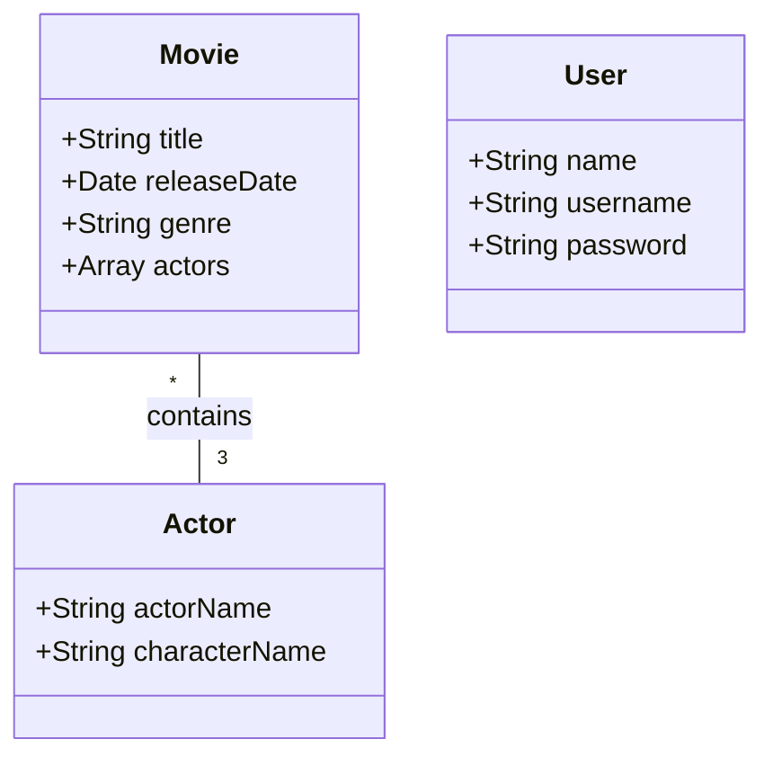

## Purpose
This assignment aims to enhance your understanding of NoSQL databases, particularly MongoDB. You will build a Users collection for storing user data and implement a signup and signin functionality. Additionally, you will also create a Movies collection to store movie information. All endpoints will be secured with JWT tokens obtained from successful signin operations.

## Prerequisites

- Basic knowledge of JavaScript
- Basic knowledge of Node.js
- Node.js installed on your local machine
- Access to [GitHub Classroom](https://classroom.github.com/classrooms)
- Accept GitHub Classroom – this should have been provided to you by your instructor. [Classroon Assignment3](https://classroom.github.com/a/UB619vlQ)
- GitHub Classroom will clone the repository [CSC3916_Assignment3](https://github.com/AliceNN-ucdenver/CSC3916_Assignment3) for you into your GitHub Classroom repository. 
- There is also a REACT deployment that you will need to clone and deploy to a static site hosting service. [Classroom CSC3916_REACT](https://classroom.github.com/a/-6Q60Eay)
- GitHub classroom will clone the repository [CSC3916_REACT](https://github.com/AliceNN-ucdenver/CSC3916_REACT)

## Steps

**Step 1: Create MongoDB Movie and User Collections**

Create two MongoDB collections to store movie and user information.

Movie Collection Schema:

```javascript
const MovieSchema = new mongoose.Schema({
  title: { type: String, required: true, index: true },
  releaseDate: Date,
  genre: {
    type: String,
    enum: [
      'Action', 'Adventure', 'Comedy', 'Drama', 'Fantasy', 'Horror', 'Mystery', 'Thriller', 'Western', 'Science Fiction'
    ],
  },
  actors: [{
    actorName: String,
    characterName: String,
  }],
});
```

User Collection Schema (this is provided to you in the scaffolding project):

```javascript
const UserSchema = new mongoose.Schema({
  name: String,
  username: { type: String, unique: true },
  password: String, // this should be hashed in real-world scenario
});
```

Ensure that your Movies collection contains at least five movies.

**Step 2: NodeJS Web API**

Create a NodeJS Web API to interact with your MongoDB database. This API should adhere to best practices, including having a separate route for each collection (e.g., `/movies`). The API should support all CRUD operations (GET, POST, PUT, DELETE).

Ensure that incoming entities contain the necessary information. If a movie does not contain actors, for instance, the entity should not be created and an error should be returned instead.

**Step 3: User Authentication and JWT Token**

Implement JWT authentication for all your endpoints. To achieve this, you must also implement a User collection in MongoDB, each user document should include:

- `name` (String)
- `username` (String, unique)
- `password` (String, hashed)

If a user tries to sign up with a username that already exists, return an error message stating that the user already exists. 

Remember to store your JWT secret key in an environment variable.

**Step 4: Implement Signup and Signin in the Frontend**

Update the existing pre-react CSC3916_REACT project to support `/signup` and `/signin` operations. The React Single Page App should interact with your Assignment 3 API for these operations.

**Step 5: Deploy Frontend to Static Site Service**

Deploy your updated React app to a static site hosting service, such as Render or Netlify. Make sure to set any necessary environment variables (such as API URLs) in the hosting service's settings.

## Mermaid Entity Relation Diagram



#Route Details
| Route | GET | POST | PUT | DELETE |
| --- | --- | --- | --- | --- |
| movies | Return all movies| save a single movie | FAIL | FAIL |
| movies/:movieparameter | Return a specific movie based on the :movieparameter | FAIL | Update the specific movie based on the :movieparameter in your case it’s the title | Delete the specific movie based on the :movieparamters your case it’s the title |*

* If Query String (Later Homework) reviews=true aggregate in reviews

Sorry for the interruption, here's the completed markdown:

## Submissions

- All source code should be hosted on GitHub. Remember to exclude the `node_modules` directory using a `.gitignore` file.
- Your API should be deployed to either Heroku or Render.
- A Postman collection including the following tests:
    - Signup a user (create a random username and password in your pre-test)
    - Signin a user – parse the returned JWT token and store it as a Postman environment variable
    - Separate requests for each endpoint (save a movie, update a movie, delete a movie, and get a movie)
    - Test error conditions (e.g., user already exists, movie missing required information)
- Create a `readme.md` file at the root of your GitHub repository. Embed your Postman collection using markdown.
- Submit the URL of your GitHub repository to the CSC_3916 assignment on Canvas.

Note: All tests should target your Heroku or Render endpoint.

## Rubric

- -5 for missing REACT site (-2 if you are not able to signup or signin on the react site) that is all we implemented
- -1 for MovieSchema missing any of the attributes (array of actors, genre, year released, or title)
- -2 for missing routes for /movies (POST/PUT/DELETE/GET)
- -1 for missing authentication on routes
- -2 for not deployed on Heroku/Render
- -1 missing test error conditions
- -1 missing PostMan tests (signup, signin, separate call for each route)

## Resources
- [MongoDB Cloud Atlas](https://www.mongodb.com/cloud/atlas)
- Create a Free Subscription on Amazon Web Services
- [Render Documentation for Deploying a Create-React-App](https://render.com/docs/deploy-create-react-app)
- Important: Remember to set the Environment Variable for https://github.com/AliceNN-ucdenver/CSC3916_REACT `env.REACT_APP_API_URL`