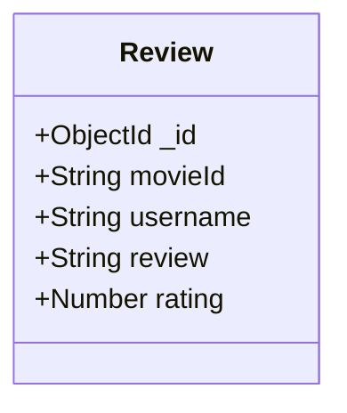

## Purpose

Using the information already entered to MongoDB for the previous assignment, you will add another collection of reviews that are tied to the movies. This way users can query the database and get the previous information (title, year released and actors) as well as the reviews. 

The purpose of this assignment is to leverage Google’s analytics policies to gather information about the requests being sent in by users. 

## Pre-requisites
- Basic knowledge of JavaScript and Node.js
- MongoDB account and basic understanding of MongoDB and Mongoose
- Google Analytics account
- Postman for testing APIs
- Git and GitHub for version control
- Basic knowledge of deployment to Heroku or Render
- Source code from Assignment3 
- Access to [Classroom](https://classroom.github.com/a/lL__a5zB)
- GitHub Classroom will clone the repository [CSC3916_Assignment4](https://github.com/AliceNN-ucdenver/CSC3916_Assignment4) for you into your GitHub Classroom repository. 

## Step 1: Create a new Collection for Reviews
In your MongoDB database, create a new collection named `Reviews` to hold reviews about movies. Each review should contain the following fields:
- `movieId`: from the `Movies` collection
- `username`: name of the reviewer
- `review`: the actual review text
- `rating`: rating out of five stars given by the reviewer



Here's an example of a Mongoose schema for the `Review`:

```javascript
const reviewSchema = new mongoose.Schema({
  movieId: { type: mongoose.Schema.Types.ObjectId, ref: 'Movie' },
  username: String,
  review: String,
  rating: { type: Number, min: 0, max: 5 }
});
```

## Step 2: Update API to Include Reviews
Your API from assignment 3 should be updated to interact with the `Reviews` collection. It should support `GET` and `POST` operations for reviews, with `DELETE` being optional. The `POST` operation should be secured with a JWT authorization token. 
- If review created send back JSON message `{ message: 'Review created!' }`

## Step 3: Implement Aggregation of Reviews and Movies
If the user sends a request with the query parameter `reviews=true`, the response should include the movie information as well as all the reviews for the movie. This aggregation can be done using MongoDB's `$lookup` operator or Async.js library.

Here's a quick example of how you could use `$lookup` in Mongoose to aggregate data from `Items` and `Orders` collections:

```javascript
Order.aggregate([
  {
    $match: { _id: orderId } // replace orderId with the actual order id
  },
  {
    $lookup: {
      from: "items", // name of the foreign collection
      localField: "items", // field in the orders collection
      foreignField: "_id", // field in the items collection
      as: "itemDetails" // output array where the joined items will be placed
    }
  }
]).exec(function(err, result) {
  if (err) {
    // handle error
  } else {
    console.log(result);
  }
});
```

## Step 4: Add Custom Analytics (Extra Credit)
Create a custom analytics policy that describes the number of times each movie has been reviewed. 

- Create a custom analytics policy that describes the number of times each movie has been reviewed. To do this, you will have to send a number of requests for each movie.
  - Custom Dimension: Movie Name
  - Custom Metric: Requested: Value 1 (it will aggregate)
- Custom Dimension and Metric should be sent with an Event type
  - Event Category: Genre of Movie (e.g. Western)
  - Event Action: Url Path (e.g. post /reviews)
  - Event Label: API Request for Movie Review
  - Event Value: 1

To open up the screens on Google Analytics you need to implement the first property: https://support.google.com/analytics/answer/10269537Links to an external site.

Also it takes awhile for events to show up (for it to index) so don't worry if you don't see your events immediately.

```javascript
var express = require('express');
var bodyParser = require('body-parser');
const crypto = require("crypto");
var rp = require('request-promise');

var app = express();
app.use(bodyParser.json());
app.use(bodyParser.urlencoded({ extended: false }));

var router = express.Router();

const GA_TRACKING_ID = process.env.GA_KEY;

function trackDimension(category, action, label, value, dimension, metric) {

    var options = { method: 'GET',
        url: 'https://www.google-analytics.com/collect',
        qs:
            {   // API Version.
                v: '1',
                // Tracking ID / Property ID.
                tid: GA_TRACKING_ID,
                // Random Client Identifier. Ideally, this should be a UUID that
                // is associated with particular user, device, or browser instance.
                cid: crypto.randomBytes(16).toString("hex"),
                // Event hit type.
                t: 'event',
                // Event category.
                ec: category,
                // Event action.
                ea: action,
                // Event label.
                el: label,
                // Event value.
                ev: value,
                // Custom Dimension
                cd1: dimension,
                // Custom Metric
                cm1: metric
            },
        headers:
            {  'Cache-Control': 'no-cache' } };

    return rp(options);
}


router.route('/test')
    .get(function (req, res) {
        // Event value must be numeric.
        trackDimension('Feedback', 'Rating', 'Feedback for Movie', '3', 'Guardian\'s of the Galaxy 2', '1')
            .then(function (response) {
                console.log(response.body);
                res.status(200).send('Event tracked.').end();
            })
    });

app.use('/', router);
console.log("http://localhost:8080/test");
app.listen(process.env.PORT || 8080);
```

## Step 5: Create a Postman Test Collection (continued)
- Invalid request (for a movie not in the database) without the review query parameter
- Valid request with the review query parameter (e.g `reviews=true` on the `/movies/:id` route)
- Valid save review method that associates a review with a movie (save a review for a movie in your DB)
- Invalid save review (movie missing from DB)

## Step 6: Write the Code
Write the code that fulfills all the requirements mentioned in this assignment.

## Step 7: Deployment
Deploy your API on Heroku or Render. Make sure your MongoDB database is also accessible from your deployed API.

## Step 8: Create a README file
Create a README.md file at the root of your GitHub repository that includes the following:

- Explanation of your project
- Installation and usage instructions
- Link to your Postman test collection
- The environment settings

## Step 9: Submit your Work
Submit the URL of your GitHub repository and the deployed API on the designated platform.

# Rubric
- This assignment has an extra credit – code the custom analytics that correctly sends the movie name and attach a PDF or Excel report from Google Analytics you receive (+4)
- -2 if missing reviews collection
- -2 if missing query parameters `?reviews=true` that returns reviews (should include both movie and reviews)
- -1 for each test that is missing (valid request for movie with query parameter, valid save review, invalid movie request, invalid save review) – for max of (-4 for missing all tests)
- -2 if you have to manually copy the JWT token to get their tests to run (versus saving it from the sign-in call)
- Try changing the review data to enter a different review before submitting to validate new review are returned – if not (-1)

# Resources
- [Google Universal Analytics](https://github.com/daxko/universal-ga)
- [Google Analytics Custom Dimensions and Metrics](https://developers.google.com/analytics/devguides/collection/analyticsjs/custom-dims-mets) 
- [Google Cloud Integration with Analytics](https://cloud.google.com/appengine/docs/flexible/nodejs/integrating-with-analytics)
- [Async.js](https://caolan.github.io/async/index.html)
- [Google Analytics Support](https://support.google.com/analytics/answer/2709829)
